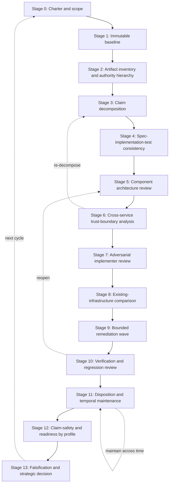

# An Evidence-Layered, Temporally Maintained Review Method for Agentic Trust Infrastructure

**Authors:** [Author Name], [Affiliation] · [Author Name], [Affiliation]
*(placeholders — to be completed before circulation)*

**Corresponding author:** [email placeholder]

**Version:** Working draft, 2026-07-02

---

## Status and Disclosure Statement

This is a **working methodology paper**, not a peer-reviewed publication, a specification, or repository documentation. It has not been peer reviewed, independently replicated, or externally validated. Readers should treat every general claim as a hypothesis derived from a single case study until independent replication exists.

The following disclosures are material to interpreting the paper and are stated here rather than in a footnote:

- **Single-case derivation.** The methodology is extracted from one project — the Dillweed Namespace Project — reviewed at commit `110c4c1` (2026-07-01). One case cannot establish generality; it can only motivate a method and demonstrate its stages.
- **The case-study review corpus is substantially AI-assisted.** The Dillweed reviews cited throughout were produced with large-language-model assistance, commissioned and curated by the project's sole steward. The project's own ledger draws this distinction explicitly (`PROJECT_LEDGER.md`, item AI-008). These reviews are **not** independent third-party assessment and **not** peer review, and this paper never treats them as such.
- **This paper was itself produced with AI assistance** and requires human editorial review and citation verification before any submission. External literature citations in §8 and the References must be checked against primary sources by a human editor; they are included as the intended scholarly scaffolding, and each is marked with its verification status.
- **No security claim follows from the method.** Applying this methodology does not make a system secure, and finding closure, declining finding counts, or passing tests do not demonstrate security. The method structures evidence and exposes gaps; it does not certify trustworthiness.
- **No production or independence claim.** Neither the case-study project nor this methodology has been exercised in production, operated by an independent party, or reproduced by an independent reviewer at the time of writing.

---

## Abstract

Agentic systems increasingly depend on *trust infrastructure*: naming, identity, registration, signed records, discovery, resolution, revocation, transparency, and the audit evidence that downstream policy engines consume to decide whether an action may proceed. Such infrastructure is unusually hard to review. Its security properties cross service boundaries; a component can be locally correct while the assembled system is insecure; specifications, code, deployment guidance, and governance documents can quietly contradict one another; and fixes render earlier review documents stale without any statement to that effect. Early projects in this space typically lack production telemetry, adversarial users, and independent operators, and increasingly rely on AI-assisted review that can manufacture both breadth and false confidence.

This paper proposes an **evidence-layered, temporally maintained review methodology** for early agentic trust infrastructure, derived from a longitudinal case study of the Dillweed Namespace Project. The method assembles several established practices — baseline pinning, claim decomposition, threat modeling, standards-conformance and interoperability testing, iterative verification, and safety-case reasoning — into one workflow, and adds elements specific to this problem class: cross-service trust-boundary analysis, adversarial *second-implementer* review, controlled finding disposition with explicit temporal maintenance, deployment-profile gating of readiness claims, and an explicit provenance discipline for AI-assisted review. We formalize an evidence taxonomy in which evidence strength is relative to the claim; separate severity, confidence, and evidence completeness as independent finding attributes; and give claim-specific closure rules under which "merged," "issue closed," "test passed," and "documentation updated" are each individually insufficient.

We derive the method from worked case evidence, distinguishing throughout what was *observed* in the case, what is *assembled established practice*, and what is *a new hypothesis requiring validation*. We identify threats to validity — single-case selection bias, the documentation-richness of the case, model dependence of AI-assisted findings, and the possibility that the method documents *consistency* rather than *trustworthiness* — and propose a validation agenda. The contribution is restrained: an integrated, falsifiable review workflow that another team could apply to a different agentic trust-infrastructure project and reproduce, improve, or falsify. Where the case supports only a case report rather than a general method, we say so and state what additional evidence would be required.

---

## Keywords

trust infrastructure; agentic systems; independent verification and validation; security review methodology; threat modeling; trust boundary analysis; standards conformance; interoperability testing; software assurance; transparency logs; AI-assisted review; assurance cases; finding disposition; deployment-profile readiness

---

## 6. Introduction

Autonomous software agents increasingly select and invoke capabilities they did not author, across organizational boundaries, on the basis of machine-readable trust signals. The infrastructure that produces those signals — that names a capability, binds it to an identity, records its registration, signs its description, publishes its revocation state, and supplies audit evidence to a policy engine — is a distinct and consequential software category. When application code fails, one application misbehaves. When *trust infrastructure* fails, every relying system that consulted it may act on a false belief, and may do so silently. The blast radius is multiplicative rather than additive.

Reviewing this category is not ordinary code review. A conventional secure-code review can establish, with reasonable confidence, that a function is memory-safe, that inputs are validated, that a cryptographic primitive is used correctly. Those questions remain necessary, but they are insufficient here for reasons intrinsic to the category. First, the trust claim a system makes is usually *compound*: "this capability is trustworthy" may depend simultaneously on an identity being authentic, a signature covering the right fields, a revocation having propagated within a bound, a cache not extending the life of stale state, and an operator behaving honestly — properties owned by different components and, often, different documents. Second, the artifacts that must agree — specification, implementation, tests, deployment instructions, governance charters, and public positioning — are produced at different times by different means and drift apart. Third, a component can pass its own test suite and still be impossible to reimplement independently, which means the "standard" is in practice a single implementation. Fourth, the same finding can be acceptable in one deployment profile (a local research instance) and disqualifying in another (a public multi-operator service), so a single severity label is not even well defined without a profile. Fifth, remediation changes the code, which makes the review documents that described the old code actively misleading unless they are maintained — the defect migrates from *content* to *timing*.

These difficulties are sharpened by the conditions under which early agentic trust infrastructure is actually built and reviewed. Implementations are incomplete by design; specifications and code evolve within days; external adoption is often zero; the project may be maintained by one person; and the review itself is increasingly performed with LLM assistance that can inspect breadth no human reviewer could match while also hallucinating code paths, inheriting earlier blind spots, and lending stylistic confidence to weak evidence. Production evidence does not exist. Governance documents may be more mature than any governance institution. Architecture prose may promise guarantees the code does not implement.

This paper responds by extracting, formalizing, and critiquing a review discipline observed in one project's corpus and generalizing it into a reusable method. We are explicit that the project is the *worked case*, not proof of the method's validity. The strongest outcome we claim is that another researcher could apply the method to a different agentic trust-infrastructure project and reproduce, improve, or falsify it. A negative outcome — that the corpus supports only a case report and not a general method — is treated as acceptable and, where the evidence points that way, stated.

The remainder proceeds as follows. §7 states research questions and contributions. §8 positions the work against existing assurance, threat-modeling, conformance, formal-methods, supply-chain, and AI-assisted-review literature. §9 scopes "trust infrastructure" as a review object. §10 describes the case-study setting and its limitations. §11 explains how the method was derived. §12 formalizes the evidence model. §13 presents the staged methodology. §14 separates severity, confidence, and disposition. §15 analyzes iterative review and convergence. §16 develops the AI-assisted review protocol. §17 gives worked case examples. §18 covers readiness and stopping rules. §19 treats documentation as temporal assurance. §20 addresses strategic and institutional review. §21 consolidates the reusable method. §22 states threats to validity, §23 a validation agenda, §24 discussion, §25 conclusion. Appendices A–J supply reusable instruments.

---

## 7. Research Questions and Contributions

### 7.1 Research questions

- **RQ1 (Evidence layers).** What layers of evidence must be examined to evaluate a trust-infrastructure claim responsibly, and how do they relate?
- **RQ2 (Cross-layer consistency).** How can a reviewer systematically detect contradictions among specifications, implementations, tests, deployment instructions, governance claims, and public positioning?
- **RQ3 (Finding closure).** What evidence is sufficient to classify a finding as closed, partially closed, accepted, deferred, superseded, not-a-defect, or unverified — and how does sufficiency vary by finding type?
- **RQ4 (Temporal drift).** How can review findings remain useful after the code and specifications they describe have changed?
- **RQ5 (Iterative convergence).** What can repeated review rounds reveal, and what can declining finding counts *not* prove?
- **RQ6 (Cross-service risk).** How should a review move from isolated component analysis to system-level trust-boundary and attack-chain analysis, and what does that transition surface?
- **RQ7 (Independent implementability).** How can a reviewer determine whether a specification supports a genuine second implementation rather than merely documenting the first?
- **RQ8 (Existing infrastructure).** How should a reviewer decide whether a project creates necessary new machinery or duplicates established infrastructure?
- **RQ9 (AI-assisted review).** How can LLMs be used in review without misrepresenting independence, evidence, confidence, or closure?
- **RQ10 (Readiness and claim safety).** How should technical findings be translated into safe claims for local evaluation, public deployment, multi-operator use, and production reliance?

### 7.2 Contributions

We claim the following, at the stated strength:

1. **An integrated, staged review workflow** for early agentic trust infrastructure (§13, §21) that reconciles claims, specifications, implementation, tests, deployment, governance, temporal change, and review provenance. *Strength: assembled established practice, adapted; not individually novel.*
2. **An evidence model** (§12) in which evidence strength is explicitly relative to the claim, with an evidence ladder used descriptively rather than as a score. *Strength: adaptation of assurance-case and IV&V ideas to this category.*
3. **The separation of severity, confidence, and evidence completeness** into independent, jointly-recorded finding attributes (§14), with a reusable finding-record schema. *Strength: adaptation; the joint schema is a modest new artifact.*
4. **Cross-service trust-boundary analysis and adversarial second-implementer review** as first-class stages (§13.6, §13.7), motivated by case evidence that both surfaced defects invisible to component-level and consistency review. *Strength: adaptation of threat modeling and conformance testing, with case-grounded motivation.*
5. **Controlled finding disposition with explicit temporal maintenance** (§13.11, §19), including the principle that the dominant documentation defect in a fast-moving project is timing rather than content. *Strength: new hypothesis, case-motivated.*
6. **Deployment-profile gating** of readiness and claim safety (§13.12, §18). *Strength: adaptation of readiness-level thinking to trust-infrastructure profiles.*
7. **An AI-assisted review provenance taxonomy and disclosure protocol** (§16, Appendix I). *Strength: new hypothesis, needing validation across model families.*

We explicitly do **not** claim novelty for baseline pinning, threat modeling, conformance testing, safety cases, or supply-chain assurance individually; the contribution is their integration and adaptation, plus items 5–7.

---

## 8. Background and Related Work

This section positions the method against existing bodies of practice and research. It is deliberately selective: only work that the method builds on or departs from is discussed. **Citation-verification note:** each reference below is marked `[V]` if it names a well-established standard or work whose existence and attribution are stable and should be routinely confirmable by a human editor, or `[C]` if the editor must confirm the exact identifier/year before submission. No reference should be retained unverified.

**Independent verification and validation (IV&V).** The practice of assurance by a party organizationally and financially independent of development is long-established in safety- and mission-critical software, codified for example in IEEE 1012 for system, software, and hardware verification and validation `[V]`. IV&V contributes the central distinction this paper leans on — that *who* performs a review is itself evidence — and motivates the provenance taxonomy of §16. Our adaptation observes that "independence" in early agentic infrastructure is frequently *partial*: an AI-assisted review commissioned by the maintainer is neither self-review nor independent assessment, and IV&V's binary framing needs a gradient (§16.1).

**Software assurance and secure development.** The NIST Secure Software Development Framework (SSDF), SP 800-218 `[V]`, organizes practices for building software with fewer vulnerabilities; it frames *practices and evidence* rather than a single verdict, which aligns with this paper's evidence-first stance. Where SSDF targets the producer, our method targets the reviewer of a producer's early artifact, and adds the reconciliation of *claims* against evidence that SSDF does not center.

**AI risk management.** The NIST AI Risk Management Framework (AI RMF 1.0) `[V]` provides Govern/Map/Measure/Manage functions for AI systems. It is relevant here in two ways: the systems under review *serve* agentic AI, and the review itself is AI-assisted. We borrow its insistence on context-specific measurement and its caution against treating metrics as guarantees (§11).

**Threat modeling.** STRIDE `[V]` (spoofing, tampering, repudiation, information disclosure, denial of service, elevation of privilege) and attack trees `[C]` (Schneier's formulation) are the backbone of the component and cross-service stages (§13.5–§13.6). Our departure is emphasis: for trust infrastructure the highest-value threats are *cross-boundary trust assumptions* — one service trusting another's unverified field — which single-component STRIDE tends to under-surface (§17, Example C).

**Privacy threat modeling.** LINDDUN `[C]` provides a systematic privacy-threat taxonomy (linkability, identifiability, non-repudiation, detectability, disclosure, unawareness, non-compliance). Trust infrastructure that publishes names, registrations, and query patterns has a substantial privacy surface; we incorporate LINDDUN-style analysis into the cross-service and comparison stages rather than as a separate track.

**Safety and assurance cases; Goal Structuring Notation (GSN).** Assurance-case practice — a claim supported by structured argument and evidence — and its GSN notation `[C]` directly inform claim decomposition (§13.3) and the evidence model (§12). The key import is that a *claim* is the unit of assurance and must be decomposed into subclaims each tied to evidence. Our adaptation adds *time bound*, *deployment profile*, and *failure state* to each subclaim, because trust-infrastructure claims are profile- and time-relative in ways classic safety cases (for a fixed system in a fixed context) are not.

**Standards conformance and interoperability testing.** The distinction between conforming to a specification and *interoperating* with an independent implementation is well developed in standards engineering; the IETF's culture of "running code" and multiple interoperable implementations `[V]` is the touchstone for the second-implementer stage (§13.7). We formalize the difference between "the implementation verifies its own bytes" and "two independent implementations agree" (§17, Example E).

**Protocol security review and formal methods.** Formal verification and model checking `[C]` can establish protocol properties that testing cannot. We do not require them, but the method flags where they are the appropriate evidence (e.g., a revocation-propagation bound is a candidate for model checking rather than a test), consistent with the evidence-relative-to-claim principle.

**Software supply-chain assurance.** SLSA `[C]` (Supply-chain Levels for Software Artifacts) and reproducible-builds practice `[C]` inform baseline pinning (§13.1) and hash-pinned evidence (§12). Transparency logs and verifiable data structures — Certificate Transparency (RFC 6962) `[V]`, and the emerging SCITT effort for supply-chain transparency `[C]` — appear both as review *subject matter* (systems under review often claim transparency) and as an evidence *standard* against which "append-only by convention" claims are tested (§13.8; §17, Example G).

**Secure-design review, red teaming, adversarial testing.** These `[C]` inform the adversarial framing of §13.6–§13.7 and the insistence on negative tests in closure rules (§13). We note that red teaming produces existence proofs of failure, not assurance of absence, which is why the method pairs it with disposition and residual-risk statements rather than treating a clean red-team pass as closure.

**Architecture decision records and evidence-based systems engineering.** ADRs `[C]` and evidence-based software engineering `[C]` inform the artifact-authority hierarchy (§13.2) and the general stance that decisions and claims should carry traceable evidence.

**Maturity and readiness models.** Technology Readiness Levels `[V]` and capability-maturity thinking `[C]` inform deployment-profile gating (§13.12), but we deliberately avoid a single composite maturity score (§11), because collapsing profile-relative, claim-relative evidence into one number destroys the information the method exists to preserve.

**AI-assisted code review and model reliability.** A growing literature examines LLMs for code review, vulnerability detection, and their failure modes — hallucination, prompt sensitivity, sycophancy, and inconsistency across runs and models `[C]`. This body is the most volatile and the least settled; §16 treats it as the source of controls rather than as established method, and every claim there is marked as hypothesis.

### 8.1 The gap addressed

Each body above covers part of the problem: code, threats, compliance, safety argument, conformance, or supply chain — largely *separately*, and largely for systems that are complete, singular in authorship of truth, and reviewed by independent parties. Early agentic trust infrastructure violates those assumptions simultaneously: it is incomplete, multi-artifact with no settled source of truth, fast-moving, adoption-poor, often single-maintainer, and reviewed with AI assistance whose provenance is easily misrepresented. The integrated method this paper proposes — reconciling claims, specs, code, tests, deployment, governance, *temporal change*, and *review provenance* in one workflow — is, to our knowledge, not provided as a whole by any single source above.

We state plainly which part of this gap is literature-supported and which is inference: that the *component practices* exist and are sound is literature-supported; that they must be *integrated in this specific way for this category* is an **inference from the case study**, not an independently established result. §22 and §23 treat that inference as the central threat to validity and propose how to test it.

---

## 9. Agentic Trust Infrastructure as a Review Object

### 9.1 A scoped definition

For this paper, **trust infrastructure** is any system whose outputs are intended to influence whether another system trusts one or more of: an *identity*, a *capability*, a *registration*, a *signed artifact*, a *discovery result*, a *revocation state*, a *policy input*, an *execution decision*, or an *audit history*. The defining feature is *relied-upon output*: the system exists so that some other system will change its behavior based on the belief the infrastructure conveys.

This scope deliberately includes the compound cases that motivate the method — systems that combine several of: identity, naming, registration, signed records, capability discovery, resolution, revocation, caching and freshness, cryptographic trust roots, transparency, audit evidence, telemetry, authorization boundaries, policy-engine handoff, governance, continuity, multiple operators, and cross-organizational deployment.

### 9.2 What it is not

Trust infrastructure is distinguished from adjacent categories that require different (often lighter) review:

- **Application logic** consumes trust decisions; it is not itself relied upon by third parties as a trust source.
- **Model behavior** — what an agent decides — is downstream; trust infrastructure informs it but does not enact it.
- **Ordinary service discovery** (e.g., availability-oriented directories inside one trust domain) answers "what is reachable," not "what should be believed," and typically lacks signed records, governed revocation, or audit obligations.
- **Authorization alone** decides whether a caller may act; it consumes standing/identity evidence but is a policy function, not an evidence producer.
- **Observability alone** records what happened operationally; it becomes trust infrastructure only when its outputs are relied upon as *evidence* (e.g., signed, non-repudiable governance signals), which imposes far stronger requirements than telemetry.
- **Governance documentation alone** describes intended institutional behavior; it is not trust infrastructure until an institution actually exercises it.

### 9.3 Why failure is multiplicative

A relying system that consults trust infrastructure typically *substitutes* the infrastructure's judgment for its own investigation — that is the point of the infrastructure. Consequently a single false output (a forged signal, a stale revocation, an unverified identity accepted as verified) can be consumed by many relying systems, each acting on it as fact, often without any local signal that the belief is wrong. The failure is not only shared but *silent* and *authoritative*: relying systems have, by design, discarded the means to detect it. This is the structural reason the method insists on cross-service analysis (§13.6), claim-specific closure (§13), and profile-gated claim safety (§13.12) rather than treating trust infrastructure as ordinary software with a security label.

---

## 10. Case-Study Setting and Corpus

### 10.1 The case

The Dillweed Namespace Project (reviewed at commit `110c4c1`, 2026-07-01) is an early, single-steward reference implementation and specification stack for *capability standing* — the proposition that agents invoking capabilities across organizational boundaries need infrastructure answering what a named capability is, who governs it, whether its signed record is current or revoked, and whether the resolution decision can be reconstructed later (`docs/research-opportunities-summary.md`). It is used here purely as the worked case from which a review method is extracted; nothing in this paper argues for or against the project's merits.

The case is well suited to methodology extraction for one reason above all: it contains an unusually complete *review corpus* alongside the system, including reviews that disagree with each other and with the code over time. Concretely, the repository contains (all paths relative to the repository root):

- A **three-component reference stack** — Registry, DillClaw Resolver, Anthill — plus an MCP adapter (`registry/`, `resolver/`, `anthill/`, `mcp-server/`), with per-component test suites and an end-to-end lifecycle test (`integration-test.sh`).
- A **formal specification set** of eight documents (`specs/`: namespace-standard, dillclaw-spec, registry-spec, anthill-spec, governance, dnso-operations-charter, continuity-protocol, standards-overview).
- A **release baseline with hash pinning** (`README.md` v1 table; `PROJECT_LEDGER.md` release records).
- A **six-round specification-consistency review series** (`docs/spec-consistency-review-2026-06-09*.md` and `-2026-06-10-r6.md`).
- **Component architecture reviews** (`docs/architecture-review-registry-2026-06-10.md`, `-resolver-`, `-anthill-`).
- A **cross-service trust-boundary analysis** (`docs/cross-service-trust-boundary-analysis-2026-06-10.md`).
- **Deployment and implementer gap reports** (`docs/dillclaw-deployment-gap-report-2026-06-10.md`, `registry-mirror-deployment-gap-report-2026-06-10.md`, `anthill-signal-emitter-gap-report-2026-06-10.md`, `spec-gap-report-2026-06-10.md`).
- **Existing-infrastructure comparisons** (`docs/architecture-review-registry-vs-existing-infrastructure-2026-06-10.md`, `anthill-vs-observability-stack-2026-06-10.md`, and `ans-v2-and-capability-standing-boundary-analysis-2026-06.md`).
- **Project-wide synthesis**: a documentation-set review (`docs/documentation-set-review-2026-06-11.md`), a finding-disposition index (`docs/finding-disposition-index-2026-06.md`), a strategic evaluation (`docs/strategic-evaluation-2026-06-12.md`), research documents (`docs/potential-research-areas.md`, `research-opportunities-summary.md`), and an operations runbook (`docs/operations-runbook.md`).
- **A "W0" hardening wave** recorded in `v2-tracker.md` and the ledger, whose closures were later verified in code by the disposition index.

### 10.2 Verified case facts used in this paper

To avoid inferring precision the repository does not support, we state only counts we verified against repository text at the pinned baseline:

- The **specification-consistency series** ran **six rounds** and raised, by its own reconciled count, **8 HIGH and 21 MEDIUM** findings across the series (per-round: r1 4H/9M; r2 3H/10M; r3 1H/2M new), with the closure recorded in round 6. Earlier round summaries understated the series total as "4 HIGH and 19 MEDIUM"; the discrepancy is itself documented (`docs/finding-disposition-index-2026-06.md`, FDI-DOC-004, and the banner text on each round file). *This arithmetic discrepancy is used as a worked example (§17, Example G-adjacent) of documentation drift.*
- The **finding-disposition index** normalized **roughly 230 raw findings into 70 canonical findings** across 14 finding-bearing documents, 4 GitHub issues, and the ledger, with the disposition distribution (at the index's own baseline `c999fdd`): 5 CLOSED, 6 PARTIALLY CLOSED, 30 OPEN, 22 DEFERRED, 4 ACCEPTED-FOR-V1, 1 SUPERSEDED, 1 NOT-A-DEFECT, 1 UNVERIFIED (`docs/finding-disposition-index-2026-06.md` §3, §5).
- The **end-to-end lifecycle test** comprises **19 checks** (register → resolve → verify → revoke → propagation) per `README.md` and the disposition index.
- **One CRITICAL cross-service finding** — Anthill stores but never verifies `node_signature` — was raised by the trust-boundary analysis and remains open at the index's baseline, with code citations (`anthill/server.js`) recorded in the index.

Where this paper needs a number it did not verify, it says so. In particular, per-component test *totals* have themselves drifted between the release baseline and HEAD (`README.md` notes the release counts of 79/65+29/58 differ from the higher HEAD counts), so we cite them only as illustrations of drift, not as fixed measures.

### 10.3 Limitations of the case

The case's limitations bound every general claim in this paper:

1. **Single project**, so no cross-project variance is observed.
2. **Single primary steward**, so organizational-independence dynamics are absent.
3. **AI-assisted review commissioned and curated by the steward** — the reviews are not independent assessment (§16); shared-model and shared-prompt blind spots are plausible and, in one case (the CRITICAL escaping the consistency series), demonstrable.
4. **Minimal or absent external adoption**; no independent operator; no completed production deployment.
5. **No independent reproduction** of the whole method.
6. **Asymmetric evidence quality across components** (e.g., the Resolver corpus is deeper than the Anthill corpus).
7. **Review artifacts created over a short calendar window** (predominantly 2026-06), limiting temporal generality.
8. **The case is unusually documentation-rich**, which may make the method easier to demonstrate here than to apply elsewhere — a selection-bias threat treated directly in §22.

The appropriate reading is therefore: the case demonstrates that the method's stages *can* be executed and *do* surface distinct classes of defect, and provides worked examples of each; it does not establish that the method generalizes, is complete, or is superior to alternatives.

---

## 11. Method Derivation

The method was derived *bottom-up* from the corpus, not imposed on it. The derivation procedure was: (1) enumerate every finding-bearing and synthesis document; (2) for each, identify the *review move* it embodies — the analytical action that produced its findings (e.g., "compare normative spec text to implemented behavior," "trace a caller-supplied field across a service boundary," "attempt deployment from public docs alone"); (3) cluster review moves into stages; (4) for each stage, identify from the corpus at least one instance where the move surfaced a defect that *another* stage did not; (5) generalize the stage's inputs, activities, outputs, and exit criteria into project-independent form; (6) subject each generalized stage to the literature of §8 to distinguish established practice from adaptation from new hypothesis.

Two derivation principles were applied throughout. First, **a stage earns inclusion only if the corpus shows it catching something another stage missed** — this is why cross-service analysis (§13.6) and second-implementer review (§13.7) are separate stages rather than sub-activities of component review: the corpus shows the CRITICAL `node_signature` defect surfacing *only* at the cross-service stage after six consistency rounds and three component reviews had not raised it, and shows the mirror protocol's non-existence surfacing *only* under an attempted deployment. Second, **the method must be honest about what the corpus does not demonstrate**: several stages (notably the disposition and temporal-maintenance stage, §13.11) are motivated by the corpus's *failure* — reviews that became stale — rather than its success, and are therefore proposals to prevent an observed problem, not observed successes.

We deliberately avoid three temptations the literature warns against. We do not construct a single composite maturity score (it would destroy the profile- and claim-relativity the method preserves; cf. §8 on readiness models). We do not present unverified counts as measures (§10.2). And we do not treat the AI-assisted origin of the corpus as a strength to be showcased or a weakness to be hidden; it is a *provenance fact* that conditions how much each finding is worth, formalized in §16.

The method is named descriptively — the **Evidence-Layered, Temporally-Maintained (ELTM) review method** — rather than with a forced acronym; "evidence-layered" and "temporally-maintained" are its two load-bearing properties, and we use the descriptive name only where a label aids reference.

---

## 12. Evidence Model

The method's first commitment (answering **RQ1**) is that a trust-infrastructure review is an exercise in *evidence*, and that evidence strength is meaningful only *relative to a claim*. The same artifact can be strong evidence for one claim and near-worthless for another: a passing unit test is strong evidence that a function computes what the test asserts, and no evidence at all that a signature scheme interoperates with a second implementation.

### 12.1 Evidence taxonomy

We distinguish the following evidence types, ordered roughly by the independence and rigor they typically carry — but see §12.2 for why order is not a universal ranking:

1. **Maintainer assertion** — a statement in a README, ledger, commit message, or issue that something is true.
2. **Specification text** — normative or descriptive prose defining intended behavior.
3. **Source-code evidence** — the implementation actually present at the pinned baseline.
4. **Static-analysis evidence** — properties established by tools without execution.
5. **Unit-test evidence** — behavior asserted by executed component tests.
6. **Integration-test evidence** — behavior asserted across components (e.g., a lifecycle test).
7. **Negative-test evidence** — tests asserting that a disallowed thing is refused (often more informative than positive tests for security claims).
8. **Reproducible-build / hash evidence** — pinned artifacts whose bytes can be independently recomputed.
9. **Deployment evidence** — the system stood up and observed to behave as claimed.
10. **Independent-implementation evidence** — a second implementation built from the spec, agreeing with the first.
11. **Independent-operator evidence** — the system operated by a party other than the maintainer.
12. **Production evidence** — behavior under real load, real adversaries, real failure.
13. **Governance-document evidence** — written institutional rules.
14. **Exercised-governance evidence** — those rules actually executed (a succession performed, a dispute resolved).
15. **External expert review** — assessment by a qualified party independent of the implementation.
16. **Peer-reviewed evidence** — the strongest independence, with adversarial scrutiny of the reasoning itself.

### 12.2 Evidence is relative to the claim

The ordering above is a *typical* strength gradient, not a total order, because the *type of claim* determines which evidence is even applicable:

- A **local implementation defect** ("this endpoint is an SSRF vector") can be closed by source-code plus positive *and* negative tests (types 3, 5, 7) — governance evidence is irrelevant to it.
- A **protocol-interoperability claim** ("independent implementations can verify these signatures") cannot be closed by any amount of the first implementation's own tests; it requires specification precision plus independent-implementation evidence (types 2, 10), because "the implementation verifies its own bytes" is circular (§17, Example E).
- A **governance-concentration risk** ("no single party can unilaterally subvert the trust root") cannot be closed by code at all; it requires institutional mechanism and multiple participants (types 13→14, and structural facts), and is *falsified* by a single-key, single-steward construction regardless of code quality.
- A **production-readiness claim** requires operational evidence (types 9, 11, 12); passing tests (5, 6) are necessary but not sufficient.
- A **tamper-evidence claim** requires cryptographic verifiability (a Merkle structure with inclusion/consistency proofs, verifiable without trusting the operator), not "append-only by convention" — which is a maintainer assertion (type 1) about an operational property, the weakest evidence for the strongest-sounding claim.

The practical rule: **for each claim, name the evidence types that could close it, then check which are present.** A claim whose only available evidence type is weaker than what the claim requires is *unsupported*, no matter how confidently stated.

### 12.3 An evidence ladder, used descriptively

It is tempting to assign each finding an "evidence level 1–16" and average. We reject averaging: it manufactures false precision and lets a pile of weak evidence masquerade as strong support. Instead we use the taxonomy as a **descriptive ladder** — for any claim, the reviewer records *which* evidence types were sought, which were found, and the *gap* between what the claim requires and what exists. The output is a small vector per claim (required types; present types; missing types), not a scalar. This is the evidence half of the finding schema in §14.4 and Appendix E.

**Table 1 — Evidence layers and what each can and cannot close.**

| Evidence type | Can help close | Cannot alone close |
|---|---|---|
| Maintainer assertion | Nothing on its own; orients the reviewer | Any security or interoperability claim |
| Specification text | Ambiguity findings (by clarifying) | Implementation-behavior claims |
| Source code | Presence/absence of a control | Effectiveness of the control |
| Static analysis | Whole classes of code defect | Semantic/protocol correctness |
| Unit test | The specific behavior asserted | Anything outside the assertion |
| Integration test | Cross-component behavior on tested paths | Untested paths; scale; adversary |
| Negative test | That a disallowed action is refused | That *all* disallowed actions are refused |
| Reproducible build / hash | Artifact integrity/provenance | Design correctness |
| Deployment | That it runs and behaves as observed | Multi-operator, production, adversarial |
| Independent implementation | Spec sufficiency; interoperability | Operational or governance properties |
| Independent operator | Operability by non-authors | Production-scale behavior |
| Production | Real-world behavior | Future changes; unseen conditions |
| Governance document | Intended institutional behavior | That the institution functions |
| Exercised governance | That a process actually works once | That it works reliably/at scale |
| External expert review | Reasoning quality; blind spots | Absence of all defects |
| Peer review | The argument's soundness | Implementation/operational reality |

---

## 13. Staged Review Methodology

This section presents the fourteen stages (0–13). Each is stated with purpose, inputs, key reviewer questions, activities, outputs, and exit criteria; §21 consolidates them with failure modes and AI-suitability, and §17 supplies worked examples. §23 (Appendices) supplies templates. The stages are ordered by dependency but are iterative in practice: cross-service analysis (Stage 6) routinely sends the reviewer back to claim decomposition (Stage 3).

**Figure 1 — Methodology flow.**



### Stage 0 — Review charter and scope

**Purpose.** Fix what is being reviewed, against which claims, by whom, with what access, and when to stop — before any finding is written.
**Inputs.** Project public materials; reviewer's mandate.
**Key questions.** What trust properties does the system claim? Which are explicitly out of scope? What is the reviewer's independence category (§16.1)? What access exists (source, deploy, operate)? Which deployment profiles matter? What are the stop conditions?
**Activities.** Draft the charter (Appendix A); classify reviewer independence honestly; enumerate deployment profiles (§13.12).
**Outputs.** Review charter; scope statement; independence and provenance statement.
**Exit criteria.** Charter names the claims, profiles, access, and stop conditions; provenance statement is explicit about AI assistance and commissioning party.

### Stage 1 — Immutable baseline

**Purpose.** Make the review auditable and re-runnable (answering **RQ4**'s precondition).
**Inputs.** Repository; release records; dependency manifests; issue tracker.
**Key questions.** What exact commit, versions, hashes, dependency set, test state, and open issues define "the system" for this review?
**Activities.** Pin the commit hash; record component and spec versions; record release hashes; snapshot open issues; record the deployment configuration reviewed.
**Outputs.** Baseline manifest (Appendix B).
**Exit criteria.** Every later finding can cite the baseline; a third party could check out the same state. *Rationale:* without a pinned baseline, findings cannot be reproduced or falsified, and "is this still true?" becomes unanswerable — the review is unauditable.

### Stage 2 — Artifact inventory and authority hierarchy

**Purpose.** Know what exists and, crucially, **which artifact wins when artifacts disagree** (answering part of **RQ2**).
**Inputs.** Baseline.
**Key questions.** What are all the specifications, code, tests, schemas, deployment scripts, runbooks, governance documents, issues, release notes, public claims, and prior reviews? When two disagree, which is authoritative for which kind of question?
**Activities.** Build the artifact map (Appendix C); assign a *source-of-truth hierarchy* per question type (e.g., for cryptographic bytes, the implementation is truth until a spec with test vectors exists; for intended governance, the charter is truth about intent but not about practice); start a contradiction log.
**Outputs.** Artifact map; source-of-truth hierarchy; contradiction log.
**Exit criteria.** Hierarchy is explicit and justified. *Caution:* do not assume the ledger or README is authoritative merely because it asserts authority; in the case study, the README carried a claim ("no HIGH/MEDIUM open") contradicted by a document two directories away (documentation-set review, contradiction C5).

### Stage 3 — Claim decomposition

**Purpose.** Convert marketing- and prose-level claims into testable subclaims tied to evidence (assurance-case discipline; answering **RQ1/RQ10** setup).
**Inputs.** Public claims; specs; artifact map.
**Key questions.** For each claim — *publicly verifiable, tamper-evident, deterministic, revocation propagates, neutral, multi-organization, append-only, production-ready* — what is the object, actor, mechanism, evidence, assumption, time bound, failure state, and deployment profile?
**Activities.** For every important claim, fill a claim-to-evidence row (Appendix D): decompose to subclaims; name required evidence types (§12); mark present/missing.
**Outputs.** Claim-to-evidence matrix.
**Exit criteria.** Every headline claim decomposed; each subclaim has a named evidence requirement and a present/missing verdict. *Example:* "deterministic resolution" decomposes into subclaims about arithmetic pinning, tie-breaking, and freedom from wall-clock and per-process state — the last of which the case study's own reviews found unmet, making the unscoped claim an overclaim (§17, Example F-adjacent; disposition index FDI-RES-003).

### Stage 4 — Specification and implementation consistency

**Purpose.** Detect divergence among spec, code, and tests (core of **RQ2**).
**Inputs.** Specs; code; tests.
**Key questions.** Are normative requirements implemented? Is implemented behavior specified? Is error behavior specified? Is cryptographic serialization reproducible? Do version and lifecycle semantics agree? Do implementation *defaults* match the stated security posture? Do tests correspond to normative requirements?
**Activities.** Build a spec↔code↔test traceability matrix; walk each MUST/SHOULD to its implementation and test; flag defaults that contradict posture (e.g., fail-open when the posture is fail-closed).
**Outputs.** Traceability matrix; consistency findings.
**Exit criteria.** Every normative requirement traced to code and test or flagged as untraced. *Case grounding:* the six-round consistency series is the worked instance; §15 analyzes what it did and did not achieve.

### Stage 5 — Component architecture review

**Purpose.** Establish local correctness and local trust assumptions per component.
**Inputs.** Per-component code, specs, tests.
**Key questions.** For each component: what state does it own; what does it assume about its inputs; what are its interfaces, authentication, authorization boundaries, cryptographic operations, persistence, concurrency, scaling, failure handling, abuse controls, observability, and recovery?
**Activities.** STRIDE-style per-component analysis; record findings with severity, confidence, evidence completeness (§14).
**Outputs.** Component finding sets.
**Exit criteria.** Each component analyzed against the checklist. *Necessary but insufficient:* component review cannot see cross-boundary trust assumptions — the explicit reason Stage 6 exists.

### Stage 6 — Cross-service trust-boundary analysis

**Purpose.** Find system-level defects invisible to component review (core of **RQ6**).
**Inputs.** All component findings; interface definitions; data-flow.
**Key questions.** Where do identities, credentials, keys, authority, caller-supplied claims, signed *and unsigned* fields, cache state, lifecycle events, telemetry, audit evidence, and errors cross a boundary? At each boundary, what does the consumer *assume* about the producer, and how can that assumption be violated?
**Activities.** Draw the trust-boundary map; for each boundary, state the consumer's assumption and enforcement mechanism; construct attack chains that cross services. Specifically hunt for: one service trusting another's unverified field; a signed object containing unsigned security-relevant metadata; an authenticated endpoint accepting an unauthenticated identity assertion; a monitoring plane able to frame another component; a cache extending the life of revoked state; a shared token collapsing organizational boundaries.
**Outputs.** Trust-boundary map; attack-chain analysis; cross-service findings.
**Exit criteria.** Every boundary characterized; each "producer field" classified as verified/unverified by the consumer. *Case grounding:* this stage produced the single CRITICAL (unverified `node_signature` enabling forged, attributable governance signals) that six consistency rounds and three component reviews had not surfaced — the paper's central evidence that Stage 6 is not reducible to Stage 5 (§17, Example C).

### Stage 7 — Adversarial implementer review

**Purpose.** Test whether the *specification* — not just the code — supports use and reimplementation (core of **RQ7**).
**Inputs.** Public specs and docs *only* (the reviewer deliberately withholds private knowledge).
**Key questions.** Two separated tasks: (1) can a competent engineer *deploy the reference implementation* from public docs? (2) can they build an *independent second implementation* from the spec that interoperates?
**Activities.** Attempt each task; log every point where success required missing defaults, unstated assumptions, ambiguous serialization, incomplete schemas, undocumented endpoints, missing lifecycle behavior, non-reproducible cryptographic bytes, impossible deployment flows (e.g., a mirror with no synchronization protocol), or private knowledge.
**Outputs.** Deployment gap report; second-implementer gap report; interoperability blockers.
**Exit criteria.** Both tasks attempted to first failure or completion, with every blocker recorded. *Case grounding:* the mirror gap report found "no happy path at all" for a documented deployment mode (§17, Example D); the spec-gap report found second implementation blocked; both are defects that code review cannot produce because the code "works."

### Stage 8 — Existing-infrastructure comparison

**Purpose.** Decide whether novel machinery is necessary or duplicative (core of **RQ8**).
**Inputs.** The system's subsystems; the established-infrastructure landscape.
**Key questions.** For each novel subsystem, what established alternative exists (DNS/DNSSEC, PKI/ACME, SPIFFE/SPIRE, OAuth/OIDC, transparency logs, SCITT, Sigstore, TUF, package registries, OpenTelemetry, Prometheus, policy engines, existing agent-identity/discovery systems)? Is the novelty necessary, or a weaker reinvention?
**Activities.** Classify each subsystem: necessary-and-distinct; useful-profile/extension; partially-duplicative; better-delegated; unsupported-by-evidence; should-be-retired.
**Outputs.** Reuse-and-boundary matrix.
**Exit criteria.** Every novel subsystem classified with rationale. *Case grounding:* the comparative reviews and the ANS boundary analysis reclassified several subsystems (bespoke transparency, trust-root distribution, mirror protocol) as duplicative of stronger established or institutionally-backed infrastructure, invalidating part of a roadmap while preserving a narrower contribution (§17, Example H).

### Stage 9 — Iterative remediation wave

**Purpose.** Fix findings in bounded, evidenced batches rather than piecemeal.
**Inputs.** Prioritized findings.
**Key questions.** What is in scope for this wave; what is explicitly out; what are the acceptance criteria and tests; what is the rollback plan; what documentation must change?
**Activities.** Define the wave (scope, target findings, non-goals, acceptance criteria, tests, rollback, doc changes); implement; capture release/commit evidence.
**Outputs.** Remediation-wave plan and evidence package.
**Exit criteria.** Wave scope matches its evidence; changes are committed and identifiable. *Rationale:* fixing findings individually without a bounded wave invites inconsistency and hidden regressions — and, as the case shows, a *defined* wave can still diverge from what actually shipped (the "W0 as designed" vs "W0 as shipped" gap, documentation-set review C4), which is precisely why Stage 10 verifies rather than trusts.

### Stage 10 — Verification and regression review

**Purpose.** Establish that fixes are real, complete, and regression-free (core of **RQ3**).
**Inputs.** Remediation-wave evidence; prior findings.
**Key questions.** For each claimed closure: is the implementation changed; are there positive *and* negative tests; is the spec updated; is the runbook updated; are release notes and public claims reconciled; did the fix introduce new findings?
**Activities.** The original reviewer must **not** merely reread a statement that a fix landed. Re-derive each closure from primary evidence at the new baseline; add negative cases; search for regressions and fix-induced defects.
**Outputs.** Closure-verification record; reopened/reformulated findings; regression findings.
**Exit criteria.** Every claimed closure independently re-derived or reopened. *Case grounding:* the disposition index verified W0 closures in code ("verified, not just claimed") *and* found a fix-induced divergence (ETag support with no consumer), the pattern this stage exists to catch (§17, Example F).

### Stage 11 — Disposition and temporal maintenance

**Purpose.** Normalize findings and keep them true over time (core of **RQ4**).
**Inputs.** All findings from all stages and rounds.
**Key questions.** Which raw findings are the same canonical finding? What is each one's current disposition, evidence, residual risk, affected profiles, and last-verified baseline? Which historical reviews are now stale?
**Activities.** Deduplicate into canonical records; apply the controlled vocabulary — OPEN, PARTIALLY CLOSED, CLOSED, ACCEPTED FOR CURRENT PROFILE, DEFERRED, SUPERSEDED, NOT A DEFECT, UNVERIFIED; for each record preserve original source and severity, current severity, closure criteria, evidence, residual risk, affected profiles, and last-verified commit/date; add status banners to historical reviews *without rewriting them*; maintain a stale-document register.
**Outputs.** Finding-disposition index (Appendix G); historical-review banners; stale-document register.
**Exit criteria.** No duplicate live findings; every canonical finding carries a disposition and last-verified baseline. *Case grounding:* the disposition index normalized ~230 raw findings to 70 canonical, and its own executive summary notes the gap it exists to fill — that a reader of `docs/` alone would otherwise believe a closed finding open and miss an open CRITICAL (§19).

### Stage 12 — Claim-safety and readiness assessment

**Purpose.** Translate findings into profile-specific readiness and safe public claims (core of **RQ10**).
**Inputs.** Disposition index; claim-to-evidence matrix.
**Key questions.** For each profile — local research; independent evaluation; public read-only service; public write service; independent mirror/verifier; multi-organization; production-grade — which findings block, which merely complicate?
**Activities.** Build the deployment-profile matrix (Appendix H); assign each finding to the profiles it gates; derive a safe-claims table (which public statements the evidence supports today).
**Outputs.** Deployment-profile matrix; current gates; safe-claims table.
**Exit criteria.** Every profile has an explicit gate list; every public claim is marked supported/qualify/retire. *Principle:* a finding may be acceptable for one profile and blocking for another; readiness is never a single verdict.

### Stage 13 — Falsification and strategic decision

**Purpose.** Ask whether the project's distinct contribution survives comparison and testing, and decide accordingly.
**Inputs.** Reuse-and-boundary matrix; disposition index; claim-safety table.
**Key questions.** After comparison (Stage 8) and evidence assembly, does a distinct, defensible contribution remain? What would falsify it? What are the kill criteria?
**Activities.** State falsifiable hypotheses about the contribution; define decision gates and explicit kill criteria; choose among continue / narrow / integrate upstream / retain as research artifact / pause implementation / retire duplicated components.
**Outputs.** Falsifiable hypotheses; decision gates; kill criteria.
**Exit criteria.** A defensible strategic recommendation with the evidence and the falsifiers that would overturn it. *Case grounding:* the strategic evaluation and ANS boundary analysis together recommended narrowing and integration over independent continuation, with explicit gates — an outcome the method must permit, including retirement (§20).

---

## 14. Finding Severity, Confidence, and Disposition

A central methodological claim (motivating **RQ3**) is that **a finding is not a single label**. Reducing every finding to one severity conflates distinct questions and produces both false alarms and false comfort.

### 14.1 The four independent attributes

- **Severity** — potential impact *if the finding is real and exploited*. Independent of how sure the reviewer is.
- **Confidence** — how certain the reviewer is that the finding exists *as described*. Independent of impact.
- **Evidence completeness** — how much evidence has been gathered across spec, code, tests, deployment, and operations (the §12.3 vector).
- **Scope** — which deployment profiles are affected.
- **Remediation state** — absent / partial / complete / accepted / deferred.

### 14.2 Why the separation matters

The two decisive cases:

- **A CRITICAL finding can have low confidence.** A cross-service attack chain may have severe impact if real, but rest on an assumption the reviewer could not confirm (e.g., that a field is reachable in a given deployment). Recording it as "CRITICAL / low confidence / evidence incomplete" tells the maintainer both to prioritize *investigation* and not to panic-ship a fix for an unconfirmed defect.
- **A LOW-severity documentation defect can seriously compromise evaluation reliability.** In the case study, a README sentence ("no HIGH/MEDIUM open") that was low-severity as a *technical* matter was high-impact as an *evaluation* matter: an evaluator reading it would form a false picture of the system's state (documentation-set review, contradiction C5). Documentation defects are scored on their effect on *the reviewer's ability to reason*, not on runtime behavior.

### 14.3 Confidence and evidence completeness are not the same

A reviewer can be highly confident on thin evidence (a single unambiguous code line) or unsure despite broad evidence (many artifacts that disagree). Recording both prevents two errors: shipping fixes for low-confidence findings, and closing findings whose evidence is broad but shallow (present in code, untested).

### 14.4 A reusable finding-record schema

Every finding carries: identifier; title; **observation** (what was seen, with file/line/commit); **inference** (what the reviewer concludes, kept separate from observation); affected asset; trust boundary; severity; confidence; evidence completeness (required vs present types); deployment profile(s); source evidence (citations); closure criteria (claim-specific, §13-closure-rules); disposition (controlled vocabulary); residual risk; last-verified baseline. Appendix E gives the full schema. The **observation/inference separation** is a direct control against AI-assisted review's tendency to state inference in the confident register of observation (§16).

---

## 15. Iterative Review and Convergence

The case study's six-round consistency series is the worked example for **RQ5**. We reconstruct only verified figures (§10.2).

**Table 2 — Verified consistency-review series (case study).**

| Round | Baseline (commit) | New findings raised | Notable dynamics |
|---|---|---|---|
| r1 | pre-revision specs | 4 HIGH, 9 MEDIUM (+ LOW/INFO) | Initial sweep; normative conflicts, an unsigned-field-drives-score gap, a phantom cross-reference |
| r2 | post-r1 revision | 3 HIGH, 10 MEDIUM (+ 9 LOW/INFO) | Most r1 findings fixed; new HIGHs including a control two governance docs relied on but the resolver never implemented |
| r3 | `a3384bd` | 1 HIGH, 2 MEDIUM *new* | Fix-verification; **two fixes introduced new defects**, one a MUST-level break; commit message overclaimed closure |
| r4 | `9f74edf` | residual only (nothing HIGH open) | Fixes substantially complete; remaining tail all "fix landed in one doc, echoes missed" |
| r5 | `a4757ef` | 3 LOW | Series converged for the spec stack; commit message claimed two fixes not in the commit |
| r6 | `a504204` | closure | All three r5 LOWs fixed; scope matched message; series closed |

Series total (reconciled): **8 HIGH, 21 MEDIUM**; an earlier summary understated it as "4 HIGH, 19 MEDIUM," a discrepancy the project later documented (FDI-DOC-004).

### 15.1 What the curve shows — and what it cannot

The severity distribution declines across rounds (HIGH: 4→3→1→0→0→0). It is tempting to read this "convergence curve" as evidence the specification became sound. The method insists on the opposite discipline: **a declining finding count is consistent with genuine convergence and with several failure modes, and cannot by itself distinguish them.**

Specifically, the case exhibits, in its own record, every caution the method raises:

- **Fix-induced regressions.** r3 shows two fixes creating new defects, one MUST-level — declining *counts* masked *new* defects introduced by remediation. This is why Stage 10 verification and regression search are mandatory and why "count went down" is not closure evidence.
- **Reviewer/scope anchoring.** The series scope was *specification consistency*. It converged. Yet the single CRITICAL of the entire corpus — the unverified `node_signature` — was **not** in scope and was surfaced only later by the cross-service trust-boundary analysis. A converged narrow review coexisted with an open critical system-level defect. Convergence within a scope says nothing about risk outside it.
- **Shared-model blind spots.** The reviews were AI-assisted, plausibly by one model family with shared priors (§16). A blind spot shared across rounds would produce clean rounds without producing safety. The consistency series' silence on the cross-service CRITICAL is consistent with (though not proof of) exactly this.
- **Overclaimed closure.** r3 and r5 commit messages claimed fixes not present or not complete; a reviewer who trusted messages would have recorded false closures. Independent re-derivation (Stage 10) is the only defense.

### 15.2 Responsible convergence criteria

The method therefore defines convergence *for a declared scope*, never as "secure." A review cycle may be called converged for its scope only when: no new findings arise in two independently framed rounds within that scope; every earlier finding has been independently re-checked at the current baseline (not merely marked fixed); negative tests exist for security-relevant closures; cross-service review (Stage 6) has been completed; second-implementer review (Stage 7) has been completed where interoperability is claimed; the disposition index contains no unresolved contradictions; every claim is tied to evidence; and a residual-risk statement has been published. Even then, the correct statement is "converged for scope X with residual risks Y," not "the system is secure."

---

## 16. AI-Assisted Review Protocol

Because the case corpus is AI-assisted and AI assistance in review is now common, this is a primary section, not a caveat. It answers **RQ9**.

### 16.1 A provenance taxonomy

"Independent review" is not binary. We distinguish eight provenance categories in increasing independence:

**Table 3 — Review-provenance categories.**

| # | Category | Independence from implementation | Typical evidence weight |
|---|---|---|---|
| 1 | Maintainer self-review | None | Orientation only |
| 2 | Tool-assisted maintainer review | None (tools, same party) | Slightly higher on mechanical defects |
| 3 | **AI-assisted review commissioned by the maintainer** | Low (AI is not a party; maintainer curates) | Breadth, not independence |
| 4 | Review by a person independent of implementation | Partial | Meaningful for reasoning quality |
| 5 | Review by an independent organization | High | Strong on independence |
| 6 | Independent reimplementation | High (different builders) | Strong on spec sufficiency/interop |
| 7 | Independent operation | High (different operators) | Strong on operational reality |
| 8 | Formal peer review | Highest on reasoning | Strong on argument soundness |

**The case study's corpus is category 3.** This is stated plainly and repeatedly in this paper because category 3 is easily *misdescribed* as category 4 or 5. An LLM prompted to "act as an independent reviewer" is still category 3: the role is rhetorical, the party commissioning and curating is the maintainer, and the model's priors are not an independent organization's judgment. **Model diversity is not reviewer independence:** running two model families reduces shared-blind-spot risk (a real benefit, §16.3) but does not make the review independent of the maintainer who commissioned and curated it.

### 16.2 Risks of AI-assisted review

The method treats the following as expected failure modes, each with a control (§16.3): hallucinated code paths and behaviors; invented citations, standards, or results; failure to inspect the *current* commit (temporal confusion); overreliance on summaries rather than primary artifacts; anchoring on earlier findings; shared-model blind spots; sycophancy toward the commissioner's evident hopes; false certainty and severity inflation; stylistic persuasiveness masking weak evidence; conflating *issue closure* with *defect closure*; treating a passing test as broader than its assertion; inability to execute or inspect some artifacts (e.g., binaries, live endpoints); context truncation dropping load-bearing detail; and — the most dangerous for this paper's subject — *accidentally manufacturing a claim of independent validation* by describing a commissioned AI review as third-party assessment.

### 16.3 Controls

The method requires, for any AI-assisted review whose output will inform decisions:

1. **Pin the baseline** (Stage 1) and require the model to cite the commit it inspected.
2. **Require exact file-and-line evidence** for every finding; findings without locatable evidence are quarantined, not published.
3. **Separate observation from inference** in every finding (§14.4); the model must not state inference in observational register.
4. **Require explicit uncertainty labels** and **disconfirming evidence**: every finding must state what would show it *wrong*, and the review must include negative findings and things checked-and-found-fine.
5. **Use independent prompts with different analytical roles** (component reviewer, cross-service attacker, second implementer) rather than one omnibus prompt, to reduce single-frame blind spots.
6. **Do not supply the desired conclusion** in the prompt; ask for evidence, not endorsement.
7. **Verify every CRITICAL/HIGH finding against source** by a second pass or a human; verify every claimed *closure* independently (Stage 10) — never accept a commit message or issue status as closure.
8. **Maintain an evidence ledger** linking findings to artifacts.
9. **Route external-facing claims through human review**; an LLM must not be the last checker of a public safety claim.
10. **Disclose** model, date, access mode (source/deploy/operate), and limitations (Appendix I), and **never** call the result third-party or peer review.
11. **Preserve prompts and outputs** where practical, for auditability and replication.
12. **Compare across models or reviewers** where stakes justify it — recording it as blind-spot mitigation, not as independence.

### 16.4 Minimum disclosure

Appendix I gives a minimum AI-assisted-review disclosure statement. At minimum it must name: the provenance category (§16.1); the model(s) and date; whether the reviewer could execute/deploy/operate the system or only read it; who commissioned and curated the review; and an explicit statement that the review is not independent third-party assessment or peer review. The case study satisfies several of these in its ledger (notably the AI-008 distinction) and fails others (the README's "external review" wording, flagged by the disposition index as FDI-RESR-002) — an instructive split between a project that *knows* its provenance and *documentation that blurs it*.

---

## 16A. Quantitative Indicators, Used Cautiously

Before the worked examples, we address measurement (a sub-theme of **RQ5/RQ10**). The method permits *descriptive* indicators and forbids a *composite score*. For each candidate indicator we state what it measures, what it does not, and how it can be gamed.

**Table 4 — Candidate review indicators.**

| Indicator | Measures | Does not measure | Gaming risk |
|---|---|---|---|
| Findings per round | Review activity | System quality | Split/merge findings to move the number |
| New-finding rate | Whether the review is still discovering | Whether discovery is complete | Narrow scope to force it to zero |
| Repeated-finding rate | Fix follow-through | Whether fixes are correct | Mark repeats as "new" |
| Regression rate after fixes | Fix hygiene | Absence of latent defects | Under-test so regressions go unseen |
| Closure-verification rate | Discipline of Stage 10 | Whether closures are *correct* | Verify trivially |
| Reopened-finding rate | Honesty of prior closures | Future reopenings | Avoid reopening to protect the metric |
| Evidence-completeness rate | Breadth of evidence gathered | Evidence *strength* per claim | Count weak evidence as complete |
| Spec-to-test traceability coverage | How much normative text is tested | Test quality | Add shallow tests |
| Contradiction count | Cross-artifact hygiene | Severity of contradictions | Resolve trivial ones only |
| Deployment-blocker count (per profile) | Profile readiness distance | Effort to close | Reclassify blockers as "complicates" |
| Cross-service vs component-only finding ratio | Whether system-level review happened | System safety | — |
| % findings with explicit closure criteria | Disposition discipline | Whether criteria are right | Boilerplate criteria |
| % claims with direct evidence | Claim discipline | Evidence adequacy | Cite weak evidence |
| Independent-reproduction status | Reproducibility (binary-ish) | Correctness | — |
| Time from code change to doc reconciliation | Temporal-maintenance latency | Documentation correctness | Batch trivial doc edits |

Two disciplines govern all of them: **descriptive within a project, not comparative across projects** (a higher finding count may mean a better review or a worse system — the number cannot say which); and **no aggregation into a maturity score** (§11). Where the case study could not yield a verified value (e.g., stable per-component test totals, which drifted between release and HEAD — §10.2), we report the limitation rather than a number.

---

## 17. Worked Case Examples

Each example is short and serves one methodological lesson; none is a full re-audit. Citations are to repository artifacts at or before the pinned baseline; where a finding's own baseline differs (the disposition index uses `c999fdd`), that is noted.

**Example A — SSRF and bounded closure (Stages 5, 9, 10, 11).** The resolver's optional liveness-probe feature could be induced to issue requests to attacker-chosen internal endpoints (an SSRF vector), identified in component/cross-service review (trust-boundary finding F-8). Remediation (the W0 wave) made probing off-by-default, added an internal-range deny-list, and pinned the resolved IP; the disposition index records this as verified *in code*, not merely claimed (`resolver/server.js` deny-list/host-pinning, per the index §3). **Lesson:** closure of an implementation defect is justified by code plus the specific control plus (ideally) a negative test — and the disposition must still record *residual* profile risk: the same index notes caller-authentication for probing remained deferred, so the finding is closed for the vector but the public-service profile carries related open items. Closure is claim- and profile-specific, not global.

**Example B — Catalog truncation and trust completeness (Stages 5, 6).** A pagination limit on the registry's listing endpoint, combined with a resolver that read only the first page, meant that once the catalog exceeded the page size, records beyond it were silently invisible to the resolver (trust-boundary finding F-10). A seemingly ordinary implementation limit thus became a *trust-completeness* defect: an adversary could push a target capability past the page boundary to make it un-resolvable, or legitimate growth could silently drop records. **Lesson:** in trust infrastructure, "ordinary" limits (pagination, timeouts, caps) can degrade the *completeness* of what relying parties believe exists; integration and boundary tests, not unit tests, are the evidence that catches this.

**Example C — Anthill `node_signature`: the CRITICAL that component and consistency review missed (Stages 5→6).** The observability component defined a per-node signature field intended to authenticate signals, *accepted and stored* the field, but **never verified it**, and did not even require it (`anthill/server.js`, per disposition index §3, FDI-ANT-001). The field's mere presence created the *appearance* of a stronger guarantee than the code delivered: consumers could reasonably assume signals were authenticated. Because `originating_node` was a free-form string, any party could forge attributable governance signals against any node. Crucially, **this survived six consistency rounds and three component reviews** and was surfaced only by cross-service trust-boundary analysis, which asks "what does the consumer of this field assume, and is it enforced?" **Lesson:** a field that looks like a control is not a control; the defect lives at the boundary between the producer (who writes the field) and the consumer (who trusts it), which is exactly what Stage 6 — and only Stage 6 — examines. This single example is the paper's strongest evidence that cross-service analysis is not reducible to component or consistency review.

**Example D — The mirror protocol that does not exist (Stage 7).** The registry specification and code named a "mirror" deployment mode, but the mirror gap report, attempting to deploy one from the public documents, found "no happy path at all": no synchronization protocol, and (in code) a mirror mode that only rejected writes and echoed configuration (`registry/server.js` mirror-mode, per disposition index §4 Profile C; `registry-mirror-deployment-gap-report-2026-06-10.md`). Architecture prose implied a deployable feature that no complete flow supported. **Lesson:** a deployment-gap / second-implementer review reveals absence-of-feature that code review structurally cannot, because the code that exists "works" — the defect is in what is *missing* relative to a claimed capability.

**Example E — Canonicalization: self-verification is not interoperability (Stages 4, 7).** The signing scheme's canonicalization was defined in a way that the reference implementation could sign and verify consistently, but that a second, independent implementation could not reliably reproduce byte-for-byte (spec-gap report; the project's own ledger tracks a planned migration to a standard canonicalization scheme). The reference stack even includes a cross-implementation *byte-equivalence test* between its own two components — genuinely good practice — but that demonstrates the *two co-designed components* agree, not that an *independent* implementation would. **Lesson:** "the implementation verifies its own bytes" is evidence for the wrong claim; interoperability requires specification precision plus canonical test vectors plus an independent implementation (evidence types 2 and 10, §12.2). This is the clearest case of evidence-relative-to-claim.

**Example F — ETag partial closure: a fix on one side of an interface (Stages 9, 10).** The hardening wave added conditional-request (ETag/`304`) support to the registry's listing endpoint to cut polling cost — but the resolver contained no code to *send* the conditional request (disposition index §3, FDI-DOC-008/FDI-RES-001: "zero ETag/304 logic … verified by grep"). The server-side mitigation landed; the *system* benefit (reduced polling) did not, because the client half was absent. **Lesson:** a mitigation can be real on one side of an interface while the intended system property remains unrealized — the definition of *partial closure*, and a reason closure must be verified against the end-to-end behavior, not the changed file.

**Example G — Documentation drift after the hardening wave (Stages 10, 11, §19).** After W0 shipped, several historical review documents still described the *pre-fix* state — an evaluator reading them would believe a closed SSRF finding was open, and might miss that a CRITICAL was still open (documentation-set review; disposition index §3.6). The reviews were *accurate when written* and *misleading afterward*. The remedy was not to rewrite history but to add status banners and build the disposition index as the single current-status source. **Lesson:** in a fast-moving project the dominant documentation defect migrates from *content* to *timing*; correct historical findings become misleading, and the fix is temporal maintenance (banners + disposition index), never silent rewriting. A second, smaller instance: the series-total arithmetic ("4 HIGH, 19 MEDIUM" vs the reconciled "8 HIGH, 21 MEDIUM"), a low-severity defect with real evaluation-reliability impact (§14.2).

**Example H — Comparison invalidating a roadmap while preserving a contribution (Stages 8, 13).** Comparison with an institutionally stronger, overlapping effort (the ANS boundary analysis) concluded that much of the project's planned infrastructure duplicated machinery that a larger, multi-vendor effort had already specified and, for parts, implemented — while a narrower contribution (capability-granular lifecycle and reconstructable resolution evidence) remained distinct. The responsible output was a recommendation to narrow and integrate rather than continue independently, with explicit falsification gates. **Lesson:** a methodology for trust infrastructure must permit *retirement, integration, and strategic narrowing* as legitimate outcomes; Stage 8 comparison and Stage 13 falsification exist so that "build less, reuse more" is a reachable conclusion, not an unthinkable one.

---

## 18. Readiness, Claim Safety, and Stopping Rules

### 18.1 Deployment profiles

Readiness is assessed per profile, never as a single verdict (Stage 12). The case study's disposition index enumerates a usable profile set, which we generalize: **local research deployment; independent evaluation; public read-only service; public write service; independent mirror/verifier; multi-organization deployment; production-grade trust claims.** A finding blocks some profiles and not others: an SSRF vector barely matters for a local research instance but blocks a public service; a governance-concentration risk is irrelevant to a single-operator evaluation but disqualifies a multi-organization neutrality claim.

**Table 5 — Illustrative profile gating (schematic, not a scorecard).**

| Finding class | Local research | Public read-only | Public write | Mirror/verifier | Multi-org | Production |
|---|---|---|---|---|---|---|
| Local impl defect (e.g., SSRF), fixed | — | complicates→closed | closed | — | — | gate re-check |
| Unverified cross-service field (CRITICAL) | tolerable if isolated | blocks | blocks | blocks | blocks | blocks |
| Missing caller identity | tolerable | blocks | blocks | — | blocks | blocks |
| No mirror sync protocol | n/a | n/a | n/a | blocks | blocks | blocks |
| Governance concentration | tolerable | complicates | complicates | complicates | blocks | blocks |
| Unsigned security-relevant field | complicates | blocks | blocks | blocks | blocks | blocks |
| Documentation drift | complicates evaluation | complicates | complicates | complicates | complicates | complicates |

("—" = not applicable/negligible; cells are illustrative of the *method*, not verified project verdicts.)

### 18.2 Safe-claims table

Stage 12 produces a table mapping each public claim to *supported / qualify / retire* given current evidence. The discipline mirrors §12.2: a claim may be retired not because it is false but because its evidence type is weaker than the claim requires (e.g., "tamper-evident" backed only by append-only convention → qualify to "append-only by convention" or retire until cryptographic evidence exists).

### 18.3 Stopping rules

A review cycle may responsibly stop when its *scope is exhausted*, which is not the same as "the system is secure." Concretely, stop when: no new findings arise in two independently framed rounds within scope; all findings have controlled dispositions; all CRITICAL/HIGH findings have source verification; all claimed closures have independent re-verification; cross-service review is complete; second-implementer/deployment review is complete where relevant; public claims are reconciled to evidence; unresolved risks are mapped to deployment gates; and the external-review needs the AI-assisted/internal review cannot meet are stated explicitly. The cycle then publishes a **residual-risk statement**.

The method requires reviewers to distinguish five terminal states that are routinely conflated: **review complete for declared scope** ≠ **evaluation ready** ≠ **deployment ready** (per profile) ≠ **production ready** ≠ **independently validated**. Only the last requires provenance categories 5–8 (§16.1); an AI-assisted, maintainer-commissioned review can reach at most "review complete for scope" and can *inform* the others, never certify them.

---

## 19. Documentation as Temporal Assurance

Documentation in trust infrastructure is not commentary; it is part of the trust system, because relying parties and evaluators act on it. The method therefore treats documentation as an assurance surface with its own defects and its own maintenance discipline.

The governing observation, generalized from the case (Example G): **the largest documentation defect in a fast-moving project is usually timing, not content.** A review that was accurate when written becomes an active hazard once the code it describes changes, precisely because it *reads* as current. This is a different failure mode from "the docs are wrong" and needs a different fix.

The method's documentation-as-assurance practices, all observed as needs (sometimes as failures) in the case:

- **Version mapping.** Every spec and component version must map to the commit and to each other; the case shows how spec-version/implementation-version drift (a spec at one version documenting an implementation at another) undermines conformance claims.
- **Historical-review preservation with status banners.** Never rewrite a historical review to match new code; add a banner stating what changed and pointing to current status. The case adopted exactly this (round files carry banners; the disposition index is the pointer).
- **Source-of-truth declarations** (Stage 2) so readers know which artifact governs which question.
- **A disposition index** (Stage 11) as the single current-status source, normalizing duplicates and carrying last-verified baselines.
- **A contradiction register** listing cross-artifact conflicts and their resolution state.
- **Claim-safety language** (Stage 12) so public text does not outrun evidence.
- **Known-limitations sections, release notes, evidence links, and navigable structure** so an evaluator can find current status without reconstructing history.

The temporal-maintenance process is thus: fix current documents; preserve historical ones with banners; reconcile claims; and keep the disposition index's last-verified baselines moving forward as the code moves — a process explicitly designed to avoid rewriting history while preventing history from misleading.

---

## 20. Strategic and Institutional Analysis

Technical review alone is insufficient for trust infrastructure, because several of its most consequential properties are *institutional* and cannot be closed by code (§12.2). The method includes, at Stages 8 and 13, an examination of: concentration of authority; root-key control; operator incentives; dispute handling; succession and continuity; neutrality claims; federation; liability boundaries; adoption incentives; external dependencies; and compatibility with existing standards.

Two principles govern this analysis, both cautions against common inference errors:

- **Elaborate governance documents do not demonstrate functioning governance.** A project may have detailed charters, councils, and succession protocols for institutions that do not yet exist and processes never exercised. Governance-document evidence (type 13) is not exercised-governance evidence (type 14). In the case study, extensive governance and continuity documents coexisted with a single steward and unexecuted continuity instruments — a maturity of *documents*, not of *institutions*.
- **Institutional sponsorship does not demonstrate technical maturity.** A well-known sponsor or foundation intent signals interest, not production readiness; the two must be assessed separately (the ANS comparison in the case illustrates institutional strength on one side and technical-maturity questions on both).

The strategic method also provides the decision frame for Stage 13: given the technical findings, the comparison matrix, and the institutional analysis, a project should be steered toward one of — **continue independently; narrow; become a profile/extension of an existing system; integrate upstream; preserve as a research artifact; or retire duplicated components.** The method's contribution here is to make *narrowing and retirement first-class outcomes*: a review that can only ever recommend "continue and fix" is not a review, it is advocacy. A trigger for narrowing/retirement is a Stage 8 finding that a subsystem is a weaker reinvention of established infrastructure whose adoption is more credible; a trigger for "profile" is a distinct contribution that depends on, rather than replaces, that infrastructure.

---

## 21. The Reusable Methodology

**Table 6 — Consolidated ELTM method.** For each stage: purpose, primary output, exit criterion, dominant failure mode, and whether AI assistance is suitable (with the human/independent-specialist requirement).

| Stage | Purpose | Primary output | Exit criterion | Dominant failure mode | AI-suitable? |
|---|---|---|---|---|---|
| 0 Charter | Fix scope, claims, independence, stop conditions | Charter; provenance statement | Claims, profiles, access, stops named | Vague scope; misstated independence | Assist; human sets scope |
| 1 Baseline | Make review auditable/re-runnable | Baseline manifest | Third party can check out same state | Unpinned "latest" | Yes (mechanical) |
| 2 Inventory + authority | Know artifacts and source-of-truth | Artifact map; authority hierarchy; contradiction log | Hierarchy explicit and justified | Trusting README/ledger authority claim | Assist; human adjudicates |
| 3 Claim decomposition | Testable subclaims tied to evidence | Claim-to-evidence matrix | Every claim decomposed with evidence verdict | Leaving marketing claims whole | Assist |
| 4 Spec/impl/test consistency | Detect divergence | Traceability matrix; findings | Every normative req traced or flagged | Missing defaults-vs-posture mismatch | Yes, with source citation |
| 5 Component review | Local correctness/assumptions | Component finding sets | Checklist covered per component | Mistaking local for system correctness | Yes, with source citation |
| 6 Cross-service | System-level trust defects | Trust-boundary map; attack chains | Every boundary field classified verified/unverified | Not doing it; treating as sub-task of 5 | Assist; **high-value, verify each finding** |
| 7 Adversarial implementer | Spec sufficiency; deployability | Deployment + second-impl gap reports | Both tasks attempted, blockers logged | Using private knowledge | Assist; human/second-impl ideal |
| 8 Existing-infra comparison | Necessary vs duplicative | Reuse-and-boundary matrix | Every subsystem classified | Not-invented-here bias either way | Assist; human judgment |
| 9 Remediation wave | Bounded, evidenced fixes | Wave plan + evidence | Wave scope matches evidence | Piecemeal fixes; scope creep | Assist |
| 10 Verification/regression | Real, complete, regression-free closure | Closure-verification record | Each closure re-derived or reopened | Trusting commit messages | Assist; **must re-derive, not reread** |
| 11 Disposition + temporal | Normalize; keep true over time | Disposition index; banners; stale register | No duplicate live findings; baselines current | Rewriting history; stale docs | Assist; human owns vocabulary |
| 12 Claim-safety/readiness | Profile-gated readiness; safe claims | Profile matrix; safe-claims table | Every profile gated; every claim marked | Single readiness verdict | Assist; **human owns public claims** |
| 13 Falsification/strategy | Does contribution survive? | Hypotheses; gates; kill criteria | Recommendation + falsifiers | Advocacy instead of review | Human-led |

**Cross-cutting requirements** apply to every stage: separate observation from inference; record severity, confidence, and evidence completeness independently (§14); cite exact artifacts at the pinned baseline; and, for any AI-assisted stage, apply the §16.3 controls and disclose provenance.

---

## 22. Threats to Validity

**Construct validity — does the method measure trustworthiness or merely consistency?** The gravest threat. Much of what the method produces — traceability, contradiction logs, disposition indices — measures *internal consistency and evidence hygiene*, which is necessary but not sufficient for trustworthiness. A system can be internally consistent and insecure. The method mitigates this by requiring cross-service attack chains, negative tests, and second-implementer review (which probe *security and sufficiency*, not just consistency), and by profile-gating claims — but the mitigation is partial. We do **not** claim the method measures trustworthiness; we claim it structures evidence and surfaces gaps, and that some of those gaps are genuine security defects (Example C). Whether the method's *consistency* outputs correlate with *security* outcomes is an open empirical question (§23).

**Internal validity — could observed improvements come from prompting, familiarity, or narrowed scope rather than better engineering?** Yes, plausibly. The case's declining finding counts (§15) are confounded by reviewer familiarity and scope narrowing; the method explicitly refuses to read them as security improvement, but the confounder remains for any claim that the method "improved" the system. We treat the method as a *review* discipline, not an engineering-improvement claim.

**External validity — does a method from one project generalize?** Unknown. One case cannot establish generality. The case is single-project, single-steward, AI-reviewed, adoption-poor, and short-window (§10.3). Larger organizations, mature standards, and proprietary systems may violate the method's assumptions (e.g., no access to source; independent review already present; slower change). §23 proposes multi-project studies as the test.

**Reliability — would another reviewer reach similar findings?** Untested. Inter-reviewer agreement on findings, severities, and dispositions has not been measured. The finding schema and closure rules aim to improve reliability, but the aim is unverified.

**Model dependence — would different LLMs reproduce the results?** Untested and specifically doubtful. The case corpus is category-3 AI-assisted with plausibly one model family; §15/§16 argue shared-model blind spots could produce clean rounds without safety, and the CRITICAL-missed-by-consistency-series is consistent with this. Cross-model reproduction is a named validation study (§23).

**Selection bias — was the case unusually documentation-rich?** Almost certainly, and this cuts both ways: the richness made the method *easy to extract and demonstrate*, and may make it *hard to apply* to sparser projects (where Stages 2, 11, and 19 have little to work with). A method that presupposes a rich corpus may not survive contact with a two-file project.

**Confirmation and survivorship bias — were successful stages over-emphasized?** A risk we tried to counter by grounding several stages in the case's *failures* (stale docs, overclaimed closures, a missed CRITICAL) rather than successes. Still, the paper is written by parties sympathetic to the method's utility, and a hostile reviewer might find fewer stages "load-bearing."

**Temporal validity — will the method age?** Agent infrastructure and AI review tools are moving fast; §16's controls in particular may date quickly as model behavior changes. The stage structure (0–13) is more likely to persist than the specific AI-review controls.

We state these threats prominently (per the disclosure requirement) so that the method is not overclaimed: it is a *hypothesis about how to review*, demonstrated once, not a validated result.

---

## 23. Validation Research Agenda

The method should be tested, not adopted on faith. Each study below states hypothesis, design, measurable outcome, expected confounders, and how to read a negative result.

**S1 — Cross-project application.** *Hypothesis:* the stages surface distinct defect classes on unrelated agent-trust projects. *Design:* apply ELTM to two projects unlike the case (e.g., a larger multi-operator effort and a proprietary internal one). *Outcome:* per-stage unique-defect yield. *Confounders:* reviewer skill; access asymmetry. *Negative result* (stages surface nothing beyond ordinary review) would falsify the integration claim and reduce the paper to a case report — an acceptable outcome to be reported as such.

**S2 — AI-assisted vs human-only teams.** *Hypothesis:* AI assistance increases breadth but not independence, and shifts the error profile toward false positives. *Design:* parallel reviews of one system by an AI-assisted team and a human-only team under the same charter. *Outcome:* finding overlap, false-positive rate, unique findings per arm. *Confounders:* team skill; prompt quality. *Negative:* no difference would challenge §16's premises.

**S3 — Model-family reproduction.** *Hypothesis:* different model families reproduce fewer than a majority of each other's findings, evidencing shared-blind-spot risk. *Design:* run the AI-assisted stages with ≥3 model families on the same baseline. *Outcome:* pairwise finding-reproduction rate; blind-spot findings unique to one family. *Confounders:* prompt sensitivity. *Negative* (high reproduction) would *weaken* the shared-blind-spot caution — good news, still worth knowing.

**S4 — Inter-reviewer reliability.** *Hypothesis:* the finding schema and closure rules raise agreement. *Design:* multiple reviewers, with and without the schema, on one system; measure agreement on findings/severity/disposition. *Outcome:* agreement statistics. *Negative:* the schema does not raise agreement → revise or drop it.

**S5 — Disposition index reduces stale-status error.** *Hypothesis:* teams using the disposition index make fewer stale-status errors after a change wave. *Design:* controlled task where reviewers answer "is finding X open?" after a wave, with/without an index. *Outcome:* error rate. *Negative:* no reduction challenges §19.

**S6 — Second-implementer review yield.** *Hypothesis:* Stage 7 finds interoperability/spec-sufficiency defects that code review misses. *Design:* compare defect sets from code review vs an independent reimplementation attempt. *Outcome:* unique-to-Stage-7 defects. *Negative:* none unique → Stage 7 is redundant (contradicting Example D/E).

**S7 — Claim decomposition changes decisions.** *Hypothesis:* decomposing claims (Stage 3) changes deployment decisions vs reading prose claims. *Design:* decision task with/without the claim-to-evidence matrix. *Outcome:* decision divergence; post-hoc correctness. *Negative:* no change → Stage 3 is ceremony.

**S8 — Convergence predicts external findings.** *Hypothesis:* narrow-scope convergence does *not* predict absence of later cross-scope findings. *Design:* longitudinal — track post-convergence external findings across projects. *Outcome:* correlation between convergence and later critical findings. *A confirmed null* (no predictive value) would *support* §15's central caution.

**S9 — Cost/time vs conventional review.** *Hypothesis:* ELTM costs more upfront (disposition, temporal maintenance) but reduces re-review cost after changes. *Design:* measure reviewer-hours across a change cycle. *Outcome:* total and phase-wise cost. *Confounders:* project size.

**S10 — Maintainer burden.** *Hypothesis:* single-maintainer projects can apply a *subset* of ELTM without unsustainable documentation overhead. *Design:* action research with small-team maintainers; identify the minimum viable subset. *Outcome:* which stages survive under resource constraint. *Negative:* the method is only usable by well-resourced reviewers → an important scope limitation to publish.

---

## 24. Discussion

The method's center of gravity is a single stance: **in trust infrastructure, review is the management of claim-relative evidence over time, not the production of a verdict.** Most of what distinguishes it from ordinary security review follows from that stance — evidence typed against claims (§12), findings that separate impact from certainty from evidence (§14), closure rules that differ by claim type (§13/§25-appendix), readiness gated by profile (§18), and status maintained as the system moves (§19).

Three findings are worth drawing out. First, **the boundary is where the defects hide.** The case's only CRITICAL, and its most consequential deployment defect (the absent mirror protocol), were both *boundary* phenomena — a field trusted-but-unverified, and a capability claimed-but-unbuilt — invisible to the stages that look *inside* components or *within* the specification. If the method has one transferable lesson, it is that component review and consistency review, however disciplined and however many rounds, do not substitute for cross-service and second-implementer review.

Second, **convergence is a trap if read as safety.** The case shows a clean, converging six-round series coexisting with an open CRITICAL outside its scope, fix-induced regressions inside it, and overclaimed closures in commit messages. Declining counts measured review activity within a frame; they measured nothing about the system's safety. Any methodology that reports finding trends must, in the same breath, state what those trends cannot mean.

Third, **AI-assisted review is a provenance problem before it is a capability problem.** The models are capable enough to produce large, plausible, well-cited-looking reviews; the danger is not that they find too little but that their output is easily *misdescribed* as independent assessment. The case is instructive precisely because it does both: its ledger correctly labels the reviews AI-assisted, while a README sentence blurred them toward "external review." The method's response — a provenance taxonomy, mandatory disclosure, observation/inference separation, and independent re-derivation of every closure — is aimed at that gap between what an AI review *is* and how it can be *represented*.

We also note what the method does not do. It does not prove security; it does not replace specialist cryptographic, formal, or legal review (it flags where those are the right evidence); it does not yield a maturity score; and it does not, on the strength of one case, establish that its integration is superior to using the constituent practices separately. Those are the boundaries of the claim.

Finally, the method is designed to be able to recommend against the project it reviews. Stages 8 and 13 make "narrow," "integrate upstream," and "retire duplicated components" reachable conclusions. In the case, the honest output of comparison was exactly that — narrow and integrate rather than continue independently. A review method for trust infrastructure that cannot reach such a conclusion is not neutral, and neutrality is the one property this category most requires of its reviewers.

---

## 25. Conclusion

We have proposed an evidence-layered, temporally-maintained review methodology for early agentic trust infrastructure, derived from a single longitudinal case study and positioned against existing assurance, threat-modeling, conformance, formal-methods, supply-chain, and AI-assisted-review practice. Its distinctive features are baseline pinning, claim decomposition, cross-service trust-boundary analysis, adversarial second-implementer review, iterative closure verification, controlled finding disposition with explicit temporal maintenance, deployment-profile gating of readiness claims, and an explicit provenance discipline for AI-assisted review.

We have been deliberate about the strength of the claim. The constituent practices are established; their *integration and adaptation for this category* is an inference from one case, not a validated result; the AI-review controls and the temporal-maintenance discipline are the most novel and the least tested. We have stated threats to validity prominently, disclosed the AI-assisted and maintainer-commissioned provenance of the corpus, and refused to treat finding closure, declining counts, or passing tests as evidence of security.

If the validation agenda (§23) returns negative — if the stages surface nothing beyond ordinary review on other projects, if the disposition discipline does not reduce stale-status error, if convergence turns out to predict safety after all — then this paper should be read as a *case report* documenting one project's review corpus, and the general method should be withdrawn. That is the honest boundary of what one case can support. The additional evidence required to move from case report to validated methodology is precisely the multi-project, multi-model, inter-reviewer, and second-implementer studies proposed above. Until then, the contribution is an integrated, falsifiable review discipline offered for replication and refutation.

---

## 26. References

*Citation-verification status: `[V]` = stable, well-established source a human editor should routinely confirm; `[C]` = editor must confirm exact identifier, authors, and year before submission. No source below should be published unverified, and none should be cited beyond what a human editor can confirm against a primary source. Placeholder identifiers are marked; do not treat any identifier here as confirmed.*

1. IEEE. *IEEE Standard for System, Software, and Hardware Verification and Validation*, IEEE Std 1012. `[V]` (confirm current edition/year).
2. NIST. *Secure Software Development Framework (SSDF)*, NIST SP 800-218. `[V]` (confirm version 1.1 and date).
3. NIST. *Artificial Intelligence Risk Management Framework (AI RMF 1.0)*. `[V]` (confirm identifier NIST AI 100-1 and 2023 date).
4. Shostack, A. *Threat Modeling: Designing for Security*. Wiley. `[C]` (confirm year 2014). — STRIDE.
5. Schneier, B. "Attack Trees." *Dr. Dobb's Journal*. `[C]` (confirm 1999). — Attack trees.
6. Deng, M., Wuyts, K., Scandariato, R., Preneel, B., Joosen, W. "A privacy threat analysis framework (LINDDUN)." *Requirements Engineering*. `[C]` (confirm 2011 and venue).
7. Kelly, T., Weaver, R. "The Goal Structuring Notation — a safety argument notation." `[C]` (confirm venue/year). — GSN / assurance cases.
8. Bishop, P., Bloomfield, R. "A methodology for safety case development." *Safety-Critical Systems Symposium*. `[C]` (confirm 1998).
9. IETF. RFC 6962, *Certificate Transparency*. `[V]`.
10. IETF SCITT working group. *Supply Chain Integrity, Transparency, and Trust — architecture* (Internet-Draft/WG documents). `[C]` (confirm current draft/RFC status; SCITT was WG-status as of writing).
11. RFC 8555, *Automatic Certificate Management Environment (ACME)*. `[V]`.
12. SPIFFE/SPIRE project documentation (CNCF). `[C]` (confirm as project docs, not a standard).
13. IETF. RFC 6749, *The OAuth 2.0 Authorization Framework*; OpenID Connect Core. `[V]`.
14. The Update Framework (TUF) specification. `[C]` (confirm as specification/version).
15. Sigstore project documentation. `[C]` (confirm as project docs).
16. OpenTelemetry specification (CNCF). `[C]` (confirm as project docs).
17. SLSA (Supply-chain Levels for Software Artifacts) specification. `[C]` (confirm version).
18. Reproducible Builds project. `[C]` (confirm as project reference).
19. Clarke, E. M., Grumberg, O., Peled, D. *Model Checking*. MIT Press. `[C]` (confirm year 1999). — Formal verification/model checking.
20. Mankins, J. C. "Technology Readiness Levels." NASA white paper. `[C]` (confirm 1995). — Readiness levels.
21. Kitchenham, B., Dybå, T., Jørgensen, M. "Evidence-based software engineering." *ICSE*. `[C]` (confirm 2004). — Evidence-based SE.
22. Literature on LLM-assisted code review and vulnerability detection, and on LLM reliability/hallucination. `[C]` **Placeholder — a human editor must select and verify specific peer-reviewed sources; do not cite unspecified surveys.**
23. Dillweed Namespace Project repository, commit `110c4c1` (2026-07-01). Case-study artifacts cited inline by path: `README.md`, `docs/README.md`, `PROJECT_LEDGER.md`, `v2-tracker.md`, `integration-test.sh`, `specs/*.html`, `registry/`, `resolver/`, `anthill/`, `mcp-server/`, and the `docs/*` review corpus (architecture reviews; `spec-consistency-review-2026-06-09*.md`, `-2026-06-10-r6.md`; `cross-service-trust-boundary-analysis-2026-06-10.md`; the four gap reports; the two infrastructure comparisons and `ans-v2-and-capability-standing-boundary-analysis-2026-06.md`; `documentation-set-review-2026-06-11.md`; `finding-disposition-index-2026-06.md`; `strategic-evaluation-2026-06-12.md`; `potential-research-areas.md`; `research-opportunities-summary.md`; `operations-runbook.md`). `[V — repository-internal, verifiable at the pinned commit]`.

### 26.1 Source-method table

**Table 7 — How evidence sources were used.**

| Source class | Role in this paper | How used |
|---|---|---|
| Case repository at `110c4c1` | Primary case evidence | Method derivation (§11); worked examples (§17); verified counts (§10.2) |
| Case disposition index / doc-set review | Secondary (project self-review) | Treated as *maintainer-curated AI-assisted* evidence (category 3); used for verified counts and as worked examples, not as independent assessment |
| Established standards/frameworks (`[V]`) | External grounding | Positioning (§8); naming established vs adapted practice |
| Practitioner/project docs (`[C]`) | External grounding | Comparison targets (§13.8); marked for editor verification |
| LLM-review literature (`[C]`, placeholder) | External grounding | §16 controls; explicitly flagged as needing human-selected sources |

---

## 27. Appendices — Reusable Instruments

These are concise, method-oriented templates, not specifications. Fields in ⟨angle brackets⟩ are to be filled per review.

### Appendix A — Review Charter Template

```
System under review: ⟨name, one-line description⟩
Baseline: ⟨commit / versions — see Appendix B⟩
Claimed trust properties in scope: ⟨list⟩
Explicitly excluded properties: ⟨list⟩
Reviewer role: ⟨title(s)⟩
Independence category (§16.1, 1–8): ⟨n⟩  Commissioned by: ⟨party⟩  Curated by: ⟨party⟩
AI assistance: ⟨models, dates⟩  Access: ⟨read / deploy / operate⟩
Deployment profiles in scope: ⟨local research | eval | public read | public write | mirror/verifier | multi-org | production⟩
Threat assumptions: ⟨adversary capabilities/position⟩
Evidence limitations: ⟨what cannot be inspected/executed⟩
Stop conditions: ⟨scope-exhaustion criteria, §18.3⟩
```

### Appendix B — Baseline Manifest Template

```
Repository + commit: ⟨url@sha⟩          Date pinned: ⟨YYYY-MM-DD⟩
Component versions: ⟨name: ver, …⟩       Spec versions: ⟨doc: ver, …⟩
Release hashes: ⟨artifact: sha256, …⟩    Dependencies (lock): ⟨ref⟩
Test state at baseline: ⟨suite: pass/total, …⟩   Open issues snapshot: ⟨ids/titles⟩
Deployment configuration reviewed: ⟨profile + config⟩
```

### Appendix C — Artifact Inventory Template

```
| Artifact (path) | Type (spec/code/test/schema/deploy/runbook/gov/issue/notes/claim/review) | Version | Authoritative for | Last changed (commit) | Notes |
```
Plus a **source-of-truth hierarchy**: for each question type ⟨crypto bytes / error behavior / lifecycle / governance intent / governance practice / …⟩ name the authoritative artifact and the fallback.

### Appendix D — Claim-to-Evidence Matrix

```
| Claim | Subclaim | Object | Actor | Mechanism | Assumption | Time bound | Failure state | Profile | Required evidence types (§12) | Present | Missing | Verdict (supported/qualify/retire) |
```

### Appendix E — Finding Record Schema

```
id: ⟨PREFIX-nnn⟩
title: ⟨short⟩
observation: ⟨what was seen — file:line@commit, test name, spec §⟩
inference: ⟨what the reviewer concludes — kept separate from observation⟩
affected_asset: ⟨component/interface/doc⟩
trust_boundary: ⟨which boundary, or n/a⟩
severity: ⟨CRITICAL/HIGH/MEDIUM/LOW/INFO⟩        # impact if real+exploited
confidence: ⟨high/medium/low⟩                    # certainty it exists as described
evidence_completeness: {required_types: [...], present_types: [...], missing_types: [...]}
deployment_profiles_affected: [ ... ]
source_evidence: [ ⟨citations⟩ ]
closure_criteria: ⟨claim-specific, per §13-closure-rules⟩
disposition: ⟨OPEN | PARTIALLY CLOSED | CLOSED | ACCEPTED FOR CURRENT PROFILE | DEFERRED | SUPERSEDED | NOT A DEFECT | UNVERIFIED⟩
residual_risk: ⟨statement⟩
last_verified_baseline: ⟨commit@date⟩
```

### Appendix F — Closure-Verification Checklist

Claim-specific closure rules (a closure must satisfy the row matching the finding's *type*; "merged," "issue closed," "test passed," and "documentation updated" are each individually insufficient):

- **Implementation defect** — code change **and** positive test **and** negative/adversarial test **and** regression coverage **and** documentation update.
- **Specification ambiguity** — normative clarification **and** unambiguous schema/algorithm **and** test vectors **and** ≥1 implementation update **and** (preferably) a second implementation or independent reproduction.
- **Cross-service trust defect** — control at the correct boundary **and** verification that downstream no longer relies on spoofable input **and** end-to-end test **and** updated threat model.
- **Operational risk** — deployment control **and** fail-safe behavior **and** runbook **and** monitoring **and** recovery test where practical.
- **Governance defect** — institutional mechanism **and** assigned authority **and** exercised process **and** evidence of multiple participants where neutrality is claimed.
- **Documentation drift** — corrected current doc **and** preserved historical baseline (with banner) **and** disposition linkage **and** claim reconciliation.

General verification acts (all findings): re-derive from primary evidence at the new baseline; add negative cases; search for fix-induced regressions; reconcile spec, runbook, release notes, and public claims.

### Appendix G — Finding-Disposition Index Schema

```
Controlled vocabulary: OPEN | PARTIALLY CLOSED | CLOSED | ACCEPTED FOR CURRENT PROFILE | DEFERRED | SUPERSEDED | NOT A DEFECT | UNVERIFIED
Per canonical finding: id; canonical_title; merged_raw_findings: [source→raw id]; original_source(s); original_severity; current_severity; confidence; disposition; closure_criteria; evidence; residual_risk; affected_profiles; last_verified_baseline.
Index-level: dashboards by disposition / component / original severity; movement-since-last-baseline; contradiction register; stale-document register (doc → what changed → pointer to current status).
```

### Appendix H — Deployment-Profile Matrix

```
Profiles (columns): local research | independent evaluation | public read-only | public write | mirror/verifier | multi-org | production
Rows: each canonical finding (or finding class)
Cell values: blocks | complicates | — (n/a/negligible) | closed
Plus per-profile "current gates" list (findings that block) and a per-profile safe-claims table.
```

### Appendix I — AI-Assisted Review Disclosure Statement (minimum)

```
Provenance category (§16.1): ⟨1–8; state the number and name⟩
This review is / is not independent third-party assessment: ⟨state plainly⟩  Peer-reviewed: ⟨no, unless true⟩
Commissioned by: ⟨party⟩   Curated by: ⟨party⟩
Model(s) and dates: ⟨…⟩    Access mode: ⟨read-only | deploy | operate⟩
What the reviewer could NOT inspect/execute: ⟨list⟩
Controls applied (§16.3): ⟨baseline pinned; line-level evidence required; observation/inference separated; uncertainty + disconfirming evidence required; role-diverse prompts; CRITICAL/HIGH source-verified; closures independently re-derived; external claims human-reviewed; prompts/outputs preserved: yes/no each⟩
Model-diversity used: ⟨none | families⟩ (note: diversity ≠ independence)
Statement: This review is not a substitute for specialist cryptographic, formal, or legal review, nor for independent operation or peer review.
```

### Appendix J — Review-Round Log and Convergence Table

```
| Round | Baseline (commit@date) | Scope | New findings (by severity) | Repeated | Fix-induced/regression | Residual | Closure verified? (Stage 10) | Notes |
```
Companion **residual-risk statement** (required at stop): declared scope; what was NOT reviewed; open findings by profile; convergence claim ("converged for scope X with residual risks Y" — never "secure"); external-review needs; terminal state (review-complete-for-scope / evaluation-ready / deployment-ready-per-profile / production-ready / independently-validated).

---

*End of working draft. Human editorial actions required before circulation: (1) verify or replace every `[C]`-marked and placeholder reference against primary sources; (2) confirm the verified case counts in §10.2 and §15 against the repository at the cited commit; (3) complete author/affiliation placeholders; (4) confirm the disclosure statement reflects the actual production process of any submitted version.*
